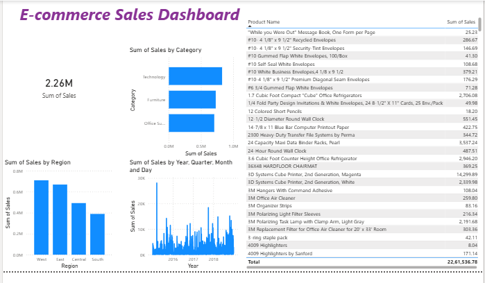

# E-commerce-Sales-Dashboard
“Power BI dashboard for e-commerce sales analysis”
# 🛒 E-commerce Sales Dashboard

## 📌 Overview
- This project analyzes e-commerce sales data using Power BI to generate business insights.

## 🛠️ Tools Used
* Power BI
* Excel

## 📊 Key Insights

* Technology category has highest sales
* Sales vary by region
* Monthly trends show fluctuations

## 📷 Dashboard

## 🚀 Conclusion

This dashboard helps understand sales performance and supports data-driven decisions.
